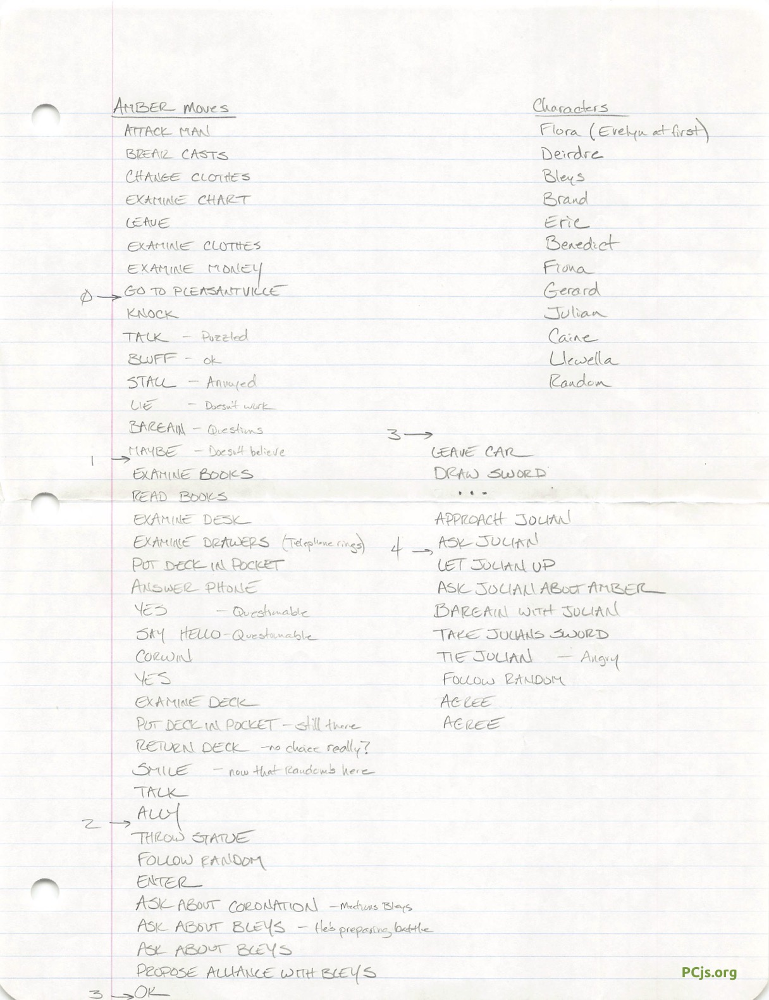
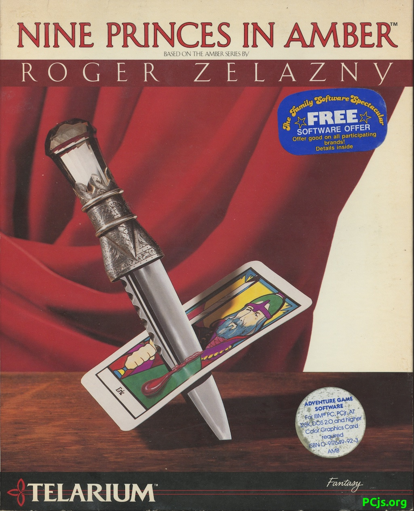

On initial startup (or reset) of the machine below, a PCjs machine script will automatically load
"Nine Princes in Amber" disks **A** and **B** into floppy drives A: and B: and then start the game.



### Preservation Notes

The **A** and **B** diskettes are from my private collection, but shortly after purchasing the game in 1985, I
modified their contents.  For starters, I had patched `AMB.EXE` on disk **A** to circumvent its copy-protection:

    push    cx
    push    ds
    xor     dx, dx
    mov     ds, dx
    mov     ah, 0
    pushf                       ; patched with NOP
    call    dword ptr ds:4Ch    ; patched with NOP, NOP, NOP, NOP
    mov     ax, 401h
    mov     cx, 0Ah
    pushf                       ; patched with CLC
    call    dword ptr ds:4Ch    ; patched with NOP, NOP, NOP, NOP
    pop     ds
    pop     cx

The copy-protection check was fairly simple: in addition to the usual sectors 1-9 on the first track of disk
**A**, it expected a sector 10 as well, and to obfuscate the sector request, it used a `PUSHF, CALL DWORD PTR DS:[004Ch]`
instruction sequence instead of `INT 13h`.  In addition to the patch, it appears I also reformatted the diskettes and
rearranged some of the files, so the original contents of the diskettes, as well as the contents of sector 10, are unknown.

I was able to restore `AMB.EXE` to its unpatched state, and I've included a fake sector 10 on the first track of disk **A**,
so the copy-protection check runs and passes.  However, it's still possible that the disk contents may not be quite right,
so if you run into problems, try running the game from a [hard disk](hdd/).

Need hints? You're in luck, because I also saved the [notes](images/Nine_Princes_in_Amber-Handwritten_Notes.jpg) I made
while playing the game back 1985/1986.

### Online References

I also scanned all the printed materials that came with the game and uploaded the PDF to the Internet Archive.

### Copy-Protection Information (Disk A)

    MFM Sector
    Sector ID:010
    Track ID:000 - Side ID:000
    Size:00128 (ID:0x00)
    DataMark:0xFB
    Head CRC:0xAC0C (Ok)
    Data CRC:0x2BF6 (Ok)

    0000| F6 F6 F6 F6 F6 F6 F6 F6 | ........
    0008| F6 F6 F6 F6 F6 F6 F6 F6 | ........
    0010| F6 F6 F6 F6 F6 F6 F6 F6 | ........
    0018| F6 F6 F6 F6 F6 F6 F6 F6 | ........
    0020| F6 F6 F6 F6 F6 F6 F6 F6 | ........
    0028| F6 F6 F6 F6 F6 F6 F6 F6 | ........
    0030| F6 F6 F6 F6 F6 F6 F6 F6 | ........
    0038| F6 F6 F6 F6 F6 F6 F6 F6 | ........
    0040| F6 F6 F6 F6 F6 F6 F6 F6 | ........
    0048| F6 F6 F6 F6 F6 F6 F6 F6 | ........
    0050| F6 F6 F6 F6 F6 F6 F6 F6 | ........
    0058| F6 F6 F6 F6 F6 F6 F6 F6 | ........
    0060| F6 F6 F6 F6 F6 F6 F6 F6 | ........
    0068| F6 F6 F6 F6 F6 F6 F6 F6 | ........
    0070| F6 F6 F6 F6 F6 F6 F6 F6 | ........
    0078| F6 F6 F6 F6 F6 F6 F6 F6 | ........
