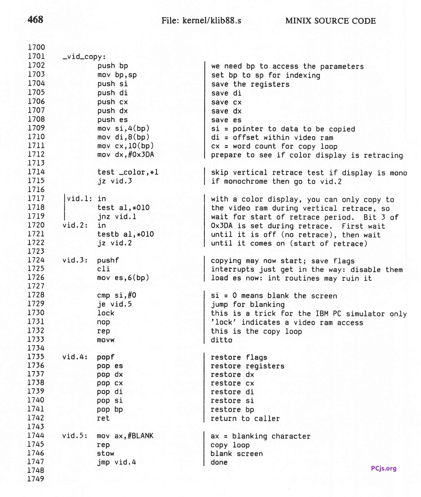
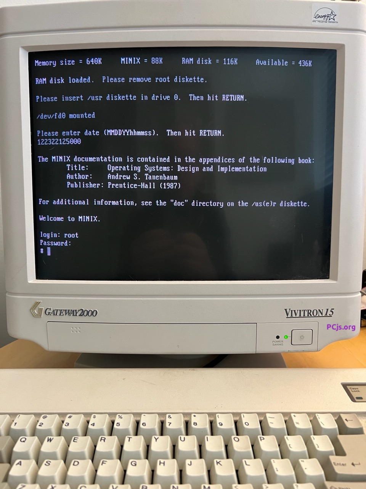

[MINIX 1.1 for the IBM PC](../) was also released for IBM PC ATs on five 1.2M diskettes.  The MINIX 1.1 software was
identical in both releases, which meant that the PC version could boot and run equally well on PC ATs, so the only real
advantage of this five-diskette release was fewer, larger diskettes.  It still runs in real-mode, so it doesn't take
advantage of the PC AT's ability to run in protected-mode or use extended memory.

In fact, there was actually a *disadvantage* to using these diskettes: the MINIX floppy disk driver attempts to
use 3 different sets of low-density drive parameters before finally settling on the correct high-density settings, and it
performs multiple retries with each set, resulting in a noticeably longer start-up time.

The five diskettes were labeled as follows:

 1. BOOT DISKETTE
 2. ROOT FILE SYSTEM
 3. /USR + /USER
 4. KERNEL, MM, FS, AND H SOURCES
 5. TOOLS AND COMMANDS SOURCES

Every diskette label also included the following information:

	MINIX BINARIES AND SOURCES FOR IBM PC/AT's
	by Andrew S. Tanenbaum
	(c) 1987 Prentice-Hall, Inc.
	ISBN: 0-13-583865-7
	MINIX 1.1

The IBM PC AT below is configured to boot from the MINIX 1.1 "Boot" diskette (shown below).  After the MINIX
boot menu appears, load the "Root" diskette and press "=" to start MINIX.

After loading the "Usr" diskette, you can login as **root** with password **Geheim**, or as user **ast** with password
**Wachtwoord**.



### Notes

It's important that the machine use a CGA video adapter rather than a VGA (or EGA), because MINIX 1.1 scrolls text by
adjusting the CRT controller start address *and* relying on frame buffer wrap-around at the 16K boundary.  VGA frame buffers
do not wrap at 16K, so MINIX scrolling will appear erratic on VGA-based systems.

Also, on December 12, 2022, I re-read my original 1.2M MINIX 1.1 diskettes and discovered that the boot disk image I had
originally posted contained a few patches.  Here are the differences:

    1c1
    < 00000000  b8 c0 07 8e d8 33 f6 b8  e0 2f 8e c0 33 ff b9 00  |.....3.../..3...|
    ---
    > 00000000  e9 51 01 8e d8 33 f6 b8  e0 2f 8e c0 33 ff b9 00  |.Q...3.../..3...|

    22,23c22,23
    < 00000150  2e 20 20 41 75 74 6f 6d  61 74 69 63 20 72 65 62  |.  Automatic reb|
    < 00000160  6f 6f 74 2e 0d 0a 00 0d  42 6f 6f 74 69 6e 67 20  |oot.....Booting |
    ---
    > 00000150  2e 20 20 00 b0 3f e6 70  eb 00 28 c0 e6 71 ba 70  |.  ..?.p..(..q.p|
    > 00000160  02 ee b8 c0 07 e9 9b fe  42 6f 6f 74 69 6e 67 20  |........Booting |

    1102c1102
    < 00004520  86 06 00 81 fe 00 00 74  32 f0 90 f3 a5 9d 81 fb  |.......t2.......|
    ---
    > 00004520  86 06 00 81 fe 00 00 74  32 90 90 f3 a5 9d 81 fb  |.......t2.......|

The original boot disk's boot sector starts with a "MOV" instruction, whereas the patched boot disk jumps
to a location inside the disk's boot sector that contains a few additional instructions in place of a string
("Automatic reboot").  Here are those instructions:

    AX=51E9 BX=7C00 CX=0007 DX=0000 SP=03FA BP=0000 SI=0000 DI=7C02 
    SS=0000 DS=0000 ES=0000 PS=0A87 V1 D0 I1 T0 S1 Z0 A0 P1 C1 
    &0000:7C00 E95101           JMP      7D54
    >> tr
    AX=51E9 BX=7C00 CX=0007 DX=0000 SP=03FA BP=0000 SI=0000 DI=7C02 
    SS=0000 DS=0000 ES=0000 PS=0A87 V1 D0 I1 T0 S1 Z0 A0 P1 C1 
    &0000:7D54 B03F             MOV      AL,3F                    ;cycles=7
    >> pr
    AX=513F BX=7C00 CX=0007 DX=0000 SP=03FA BP=0000 SI=0000 DI=7C02 
    SS=0000 DS=0000 ES=0000 PS=0A87 V1 D0 I1 T0 S1 Z0 A0 P1 C1 
    &0000:7D56 E670             OUT      70,AL                    ;cycles=2
    >> pr
    AX=513F BX=7C00 CX=0007 DX=0000 SP=03FA BP=0000 SI=0000 DI=7C02 
    SS=0000 DS=0000 ES=0000 PS=0A87 V1 D0 I1 T0 S1 Z0 A0 P1 C1 
    &0000:7D58 EB00             JMP      7D5A                     ;cycles=5
    >> pr
    AX=513F BX=7C00 CX=0007 DX=0000 SP=03FA BP=0000 SI=0000 DI=7C02 
    SS=0000 DS=0000 ES=0000 PS=0A87 V1 D0 I1 T0 S1 Z0 A0 P1 C1 
    &0000:7D5A 28C0             SUB      AL,AL                    ;cycles=7
    >> pr
    AX=5100 BX=7C00 CX=0007 DX=0000 SP=03FA BP=0000 SI=0000 DI=7C02 
    SS=0000 DS=0000 ES=0000 PS=0246 V0 D0 I1 T0 S0 Z1 A0 P1 C0 
    &0000:7D5C E671             OUT      71,AL                    ;cycles=2
    >> pr
    AX=5100 BX=7C00 CX=0007 DX=0000 SP=03FA BP=0000 SI=0000 DI=7C02 
    SS=0000 DS=0000 ES=0000 PS=0246 V0 D0 I1 T0 S0 Z1 A0 P1 C0 
    &0000:7D5E BA7002           MOV      DX,0270                  ;cycles=5
    >> pr
    AX=5100 BX=7C00 CX=0007 DX=0270 SP=03FA BP=0000 SI=0000 DI=7C02 
    SS=0000 DS=0000 ES=0000 PS=0246 V0 D0 I1 T0 S0 Z1 A0 P1 C0 
    &0000:7D61 EE               OUT      DX,AL                    ;cycles=2
    >> pr
    AX=5100 BX=7C00 CX=0007 DX=0270 SP=03FA BP=0000 SI=0000 DI=7C02 
    SS=0000 DS=0000 ES=0000 PS=0246 V0 D0 I1 T0 S0 Z1 A0 P1 C0 
    &0000:7D62 B8C007           MOV      AX,07C0                  ;cycles=5
    >> pr
    AX=07C0 BX=7C00 CX=0007 DX=0270 SP=03FA BP=0000 SI=0000 DI=7C02 
    SS=0000 DS=0000 ES=0000 PS=0246 V0 D0 I1 T0 S0 Z1 A0 P1 C0 
    &0000:7D65 E99BFE           JMP      7C03                     ;cycles=2

My best guess is that these patches were made to resolve some issue with MINIX 1.1 on a non-IBM AT clone, but that's
pure speculation, as I have no recollection of making these patches.

It's also worth noting that the final patch at offset 0x4529 (which corresponds to offset 0x129 in the sector
at CHS 1:0:5) changes a "LOCK NOP" instruction to "NOP NOP" (ie, it replaces the LOCK prefix with another NOP).

This is actually an important change if you want to run MINIX on an 80386-based PC, because while "LOCK NOP" was harmless
on the 8086/8088 (and on the 80286, as long as you were running in real-mode or with CPL <= IOPL), that instruction will
trigger a #UD fault on newer processors.  Intel decided to restrict the use of LOCK on the 80386 to a handful of
memory operations, and NOP wasn't one of them.

However, that patch isn't required if you're running MINIX on an 80386 in PCjs, because PCjs doesn't currently emulate
that behavior.  It doesn't seem worth the effort, and in fact, I would be surprised if there was *ANY* software in the
real world that relies on instructions such as "LOCK NOP" generating a #UD fault.  Let's hope Intel didn't expend too many
transistors in the CPU restricting the use of LOCK, because, really, who cares?

And why does MINIX use "LOCK NOP"?  Well, it has something to do with the behavior of the IBM PC simulator
that Andrew Tanenbaum was using while writing MINIX.  There isn't a lot of discussion about it, but here's the
relevant source code, from his 1987 book "Operating Systems: Design and Implementation":

Finally, a note on attempting to run MINIX 1.1 on a real 80386-based machine, even with the "LOCK NOP" patch: there
seems to be some code in MINIX, perhaps in the floppy driver, that runs too fast (and fails) on newer hardware. 
I've seen this error, for example, when attempting to read the second diskette:

    Unrecoverable disk error on device 2/0, block 1  
    File system panic: Diskette in drive 0 is not root file system

While investigating this problem, my [debugger](https://github.com/jeffpar/spy) inadvertently started running
MINIX with the CPU's trace flag set, which meant that every instruction was being traced, and therefore running much
slower than normal.  A happy coincidence of this bug in my debugger, however, was that the "disk error" disappeared
and MINIX successfully loaded!

Anyway, I have since restored the MINIX 1.2M boot disk to its (presumably) original unpatched state.
This also makes the MINIX boot sector a bit more unusual, insofar as it does *not* start with the usual "JMP" instruction
that the first sector of all PC DOS and MS-DOS diskettes generally start with.

